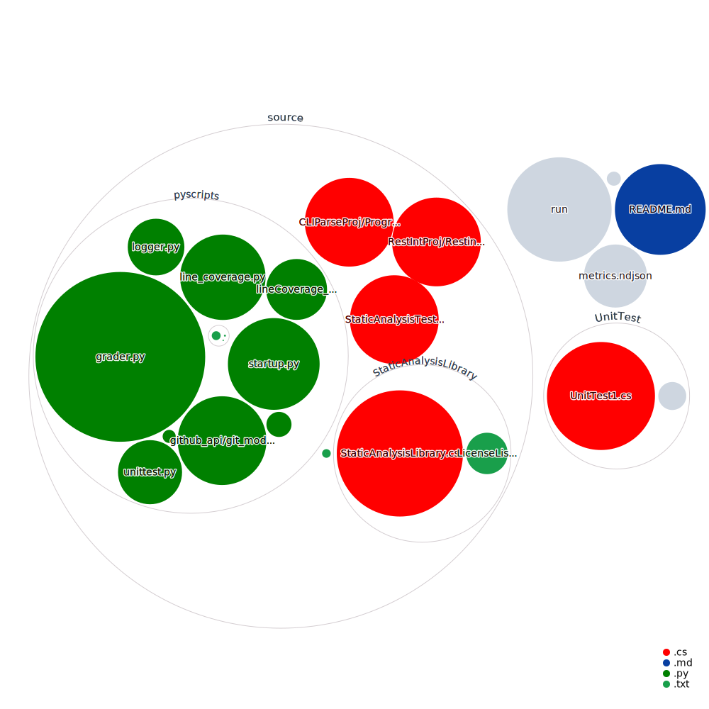

# ECE461SoftwareEngineeringProject
ECE 461 - Purdue Package manager for Software Engineering class.

Names: Rex Wang, Joseph Ma, Alan Zhang, Kevin Lin

A local CLI package manager project for ECE 461 - Software engineering (At purdue). Built mainly using C# and Python.



Rex - Shell Scipt. CLI parser, DiagramWF, grader.py, startup.py, logger.py, project board, 
Kevin - Static Analysis Library, Static Analysis Tester, gitPython.py Unit tests c#, loneCoverage_score.py, Line coverage c#
Alan - RestAPI c#, License Parser
Joseph - Github API, line coverage python, unit tests python


---

## General execution pattern

./run - shell script that calls other programs

./run install - installs dependencies, uses pip install with a requirements file in source/requirements.txt for python and dotnet add package for c#.

./run build - uses dotnet publish to build all programs

./run clean - removes all cached files, we run this before every commit to clean everything up

./run test - tests all cases (10 for python using coverage, 10 for c# with xtests) also tests line coverage 

./run <url to file> - takes the url to file, passes it to ./CLIParse, which does error checking and breaks up it to seperate urls. For each github url, it calls python3 source/pyscripts/github_api/git_module.py and it calls ./RestInt for each npm module. Both of these programs save data to data/git and data/npm respectively in json format. After it is done, it calls source/pyscripts/startup.py which will call git_module.py for each repo to clone it to data/repo. Now that we have the repo, it calls ./StaticAnalysisTester to parse the downloaded repos for code, comment, license data. Now that we have all the data, we call grader.py which handles parsing the jsons for useful data, grading it and printing the final json to results/results.ndjson

## File structure

.github - file cloc visualization workflow

.vs - vscode cache

cache - debug folder for logging.

examples - holds some example debug files and other stuff.

results - results/results.ndjson is where the final cli result is saved

source - this is where all the source code should be saved for the program itself

UnitTest - c# unit testing program code

.gitattributes - gitmetadata

.gitignore - gitmetadata

diagram.svg - generated by workflow

metrics.ndjson - static ndjson file showing where the api calls are

README.md - this file

run - shell script entry point for ./run


...

---

## How to run program

Go to /Build and execute one of the following commands

run install - installs all dependencies including pip dependencies

run build - compiles anything that needs to be compiled

run <URL> - downloads the following file URL list (example in examples/input.txt) and downloads all metadata and repo and grades it.

```shell
$ ./run /home/shay/a/wang5009/461/ECE461SoftwareEngineeringProject/examples/input.txt
```

run test - runs the unit testing test suite and exits 0 if successful

run clean - cleans all cache and log files

---

## IO for each program

./CLIParse 

I: <absolute file path to input file> <full log path to log file (including file extension)> <integer log level 0,1,2> <github token>

O: Logs to log file, calls git_module.py for each github package, calls RestInt for each npm module, calls startup.py at the end

./RestInt

I: <relative path to folder to save> <url to npm registry> <name of package> <log level> <log location>

O: Logs to log file, writes data to data/npm

git_module.py

I: <name of package> <url to github> <github token>

O: Logs to log file, writes data to data/git

startup.py

I: <log level> <log file> <abs path to input file>

Req: npm and git data

O: logs to log file, saves full repos to data/repo

grader.py

I: <log level> <log file>

Req: npm, git and static data

O: logs to log file, saves results to results/results.ndjson

logger.py (Library file)
O: handles logging to the log file for python scripts

line_coverage.py

gitPython.py (Library file)
O: clones repo to a file path


## Environment Variables

$LOG_FILE - Path to where the log file will be saved

$LOG_LEVEL - Level of logging, 0 is silent, 1 is info only, 2 is debug (everything).

$GITHUB_TOKEN - Used to access Github's graphql API
